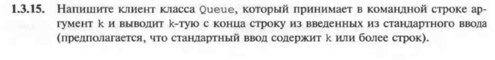
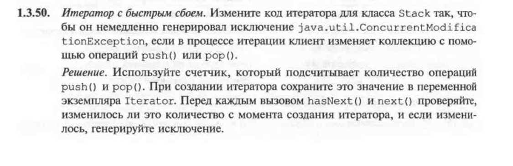
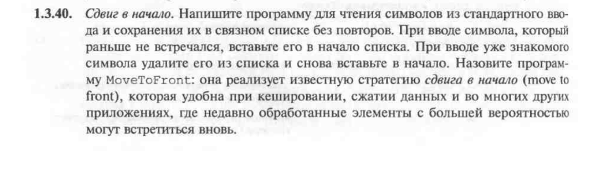

# algosJava
Папки будут именованы в соответствии с темой .
Каждая папка будет хранить в себе 4 задания.

#----------------------------------------

containers :
условие и номер firstTask : 

условие и номер firstTask :  1.3.4

План - 1 час 
Факт - 1.5 часа
(с учётом параллельного изучения синтаксиста языка, maven, теории, sonar'a)

(алгоритм был составлен менее чем за 3 минуты)

условие и номер secondTask :

План 20 минут, Факт - 20 минут.

условие и номер thirdTask :

План 40 минут, Факт - 40 минут.

условие и номер fourthTask :

План 10 минут, Факт - 10 минут.

#----------------------------------------

